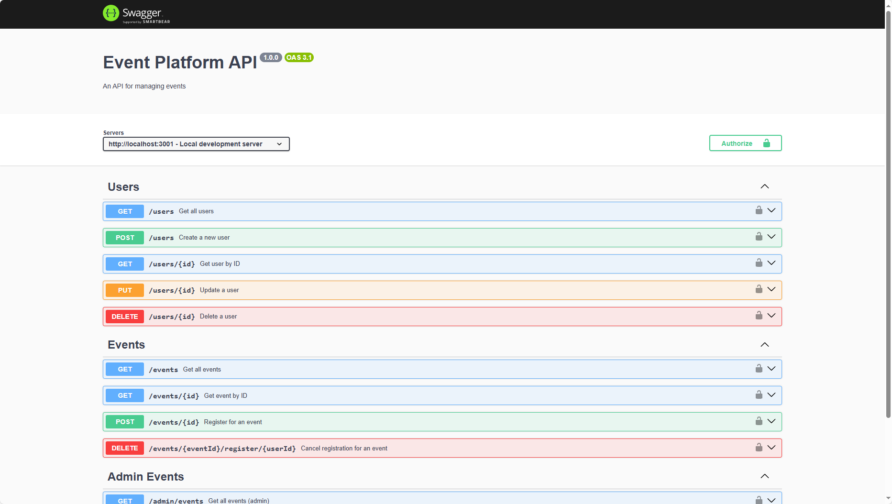

# Events Platform Backend

## Architecture Overview

This backend is built with **Node.js**, **Express**, and **TypeScript**. It uses **Prisma ORM** for database access (PostgreSQL), and supports robust authentication, event management, user registration, and admin functionalities. The backend is designed for scalability and maintainability, with clear separation of concerns and modular structure.

### Key Technologies
- **Express**: HTTP server and routing
- **TypeScript**: Type safety and modern JS features
- **Prisma**: Database ORM for PostgreSQL
- **JWT**: Authentication and authorization
- **bcryptjs**: Password hashing
- **Azure Blob Storage**: File uploads and storage
- **Zod**: Schema validation

## Features & Functionalities

- **User Authentication**
  - JWT-based login and registration
  - Password hashing with bcryptjs
  - Role-based access (user/admin)

- **Event Management**
  - Create, update, delete, and list events
  - Event details, schedules, and image uploads

- **Registration System**
  - Users can register/unregister for events
  - View registrations for events

- **Admin Features**
  - Manage users and events
  - Access to all registrations
  - Event analytics endpoints (if implemented)

- **File Uploads**
  - Integration with Azure Blob Storage for event images

- **API Documentation**
  - Swagger UI available for API exploration

- **Validation & Error Handling**
  - Zod schemas for request validation

- **Testing**
  - Automated tests ensure reliability and catch regressions early.

- **Rate Limiting**
  - Protects the API from abuse by limiting repeated requests from clients.

- **Pagination**
  - Efficiently handles large datasets by providing paginated API responses.

## Project Structure

```
backend/
├── prisma/           # Prisma schema and migrations
├── src/
│   ├── middleware/   # Express middleware (auth, error handling, etc.)
│   ├── routes/       # API route handlers
│   ├── config/       # Configuration and env parsing
│   └── index.ts      # Entry point
├── package.json
├── tsconfig.json
└── ...
```

## Getting Started

### 1. Clone the Repository

```
git clone https://github.com/your-org/events-platform-fullstack.git
cd events-platform-fullstack/packages/backend
```

### 2. Install Dependencies

```
npm install
```

### 3. Configure Environment Variables

Copy `.env.example` to `.env` and fill in the required values:

```
cp .env.example .env
```

Edit `.env` and set:
- `DATABASE_URL` (PostgreSQL connection string)
- `JWT_SECRET` (secure secret for JWT)
- `PORT` (server port, default 3001)
- `AZURE_STORAGE_CONNECTION_STRING` (for Azure Blob Storage)
- `AZURE_STORAGE_CONTAINER_NAME` (Azure container name)

All required variables are listed in `.env.example`.

### 4. Set Up the Database

Run Prisma migrations to set up the database schema:

```
npx prisma db push
```

(Optional) Open Prisma Studio to view/manage data:
```
npx prisma studio
```

### 5. Start the Server

First build the shared package to ensure types are up-to-date:
```
cd ../shared && npm install && npm run build && cd ../backend
```

Then start the server:

```

For development (with hot reload):
```
npm run dev
```

For production build:
```
npm run build
npm start
```

The server will run on the port specified in your `.env` file (default: 3001).

## Project Endpoints

All API endpoints are documented and available for exploration via Swagger UI:

[Open Swagger UI](http://localhost:3001/api-docs)



## Additional Notes
- Ensure PostgreSQL is running and accessible (see root `docker-compose.yml` for local setup).
- For Azure Blob Storage, you must have a valid Azure account and storage container.
- The backend is designed to work with the frontend client in `../client` and shared types in `../shared`.

---

For more details, refer to the main project [README](../../README.md).